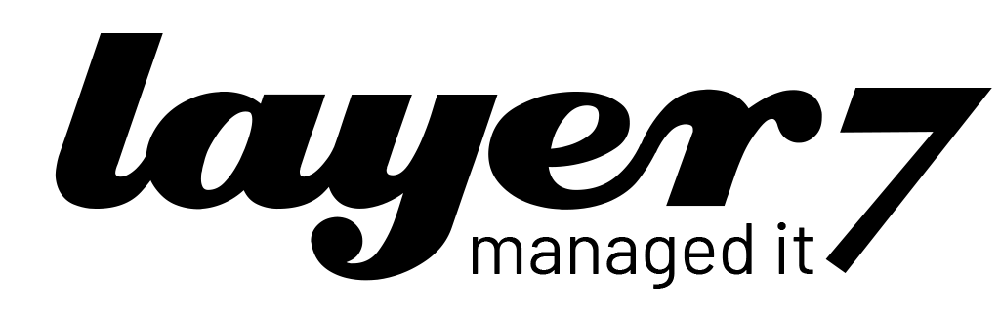

<div align="center">
<br/>
  <br/>
<p align="center">
  
</p>
  <p>
   <a href="https://img.shields.io/badge/license-BSD--3-blue)">
       
     </a> 
     <a href="https://github.com/netbirdio/netbird/blob/main/LICENSE">
       
     </a> 
  </p>
</div>


<p align="center">
<strong>
  l7 zero trust - powered by layer7 managed it
  <br/>
  See <a href="README-L7.md">Full Documentation</a>
  <br/>
   <a href="QUICKSTART.md">Quick Start Guide</a> | <a href="DEPLOYMENT.md">Deployment Guide</a>
  <br/>
 
</strong>
<br>
Custom branded distribution based on <a href="https://netbird.io">Netbird</a>
</p>

<br>

**l7 zero trust combines a configuration-free peer-to-peer private network and a centralized access control system in a single platform, making it easy to create secure private networks for your organization.**

**Connect.** l7 zero trust creates a WireGuard-based overlay network that automatically connects your machines over an encrypted tunnel, leaving behind the hassle of opening ports, complex firewall rules, VPN gateways, and so forth.

**Secure.** l7 zero trust enables secure remote access by applying granular access policies while allowing you to manage them intuitively from a single place. Works universally on any infrastructure.

---

## 🎨 l7 zero trust Branding

This is a **custom branded version** of Netbird with:

- ✅ **layer7 Branding** - Custom logos, icons, and colors (#a0cf4f)
- ✅ **Theme-Aware Icons** - Automatic light/dark mode switching
- ✅ **Automated Updates** - Weekly sync with upstream Netbird
- ✅ **Self-Hosted Ready** - Docker Compose deployment included
- ✅ **Production-Ready** - Keycloak SSO, SSL/TLS, monitoring

### Key Differences from Upstream Netbird

| Aspect | l7 zero trust | Upstream Netbird |
|--------|---------------|------------------|
| **Branding** | layer7 logos & colors | Netbird branding |
| **Primary Color** | #a0cf4f (green) | #FF7A00 (orange) |
| **Icons** | Theme-aware (black/white) | Static branding |
| **Product Name** | l7 zero trust | NetBird |
| **Updates** | Auto-sync weekly | Manual |
| **Authentication** | Keycloak (id.l7cloud.io) | Flexible |

---

## 🚀 Quick Start

### For End Users

**Windows:**
```powershell
# Download from releases
# Install l7-zerotrust-ui-installer.exe
```

**macOS:**
```bash
# Download and install
open l7-zerotrust-ui.dmg
```

**Linux (Ubuntu/Debian):**
```bash
sudo apt install l7-zerotrust-ui
```

See [QUICKSTART.md](QUICKSTART.md) for detailed instructions.

### For Administrators (Self-Hosted)

```bash
# Clone repository
git clone https://github.com/layer7-dev/l7-netbird.git
cd l7-netbird

# Configure environment
cp .env.l7.example .env
nano .env  # Edit configuration

# Deploy
docker-compose -f docker-compose.l7.yml up -d
```

See [DEPLOYMENT.md](DEPLOYMENT.md) for complete setup guide.

### For Developers

```bash
# Apply branding
./branding/scripts/apply-l7-branding.sh

# Build UI
cd client/ui
go build -o l7-zerotrust-ui
```

See [branding/README.md](branding/README.md) for development documentation.

---

## ✨ Key Features

### From Netbird (Inherited)

| Connectivity | Management | Security | Automation| Platforms |
|----|----|----|----|----|
| <ul><li>- \[x] Kernel WireGuard</ul></li> | <ul><li>- \[x] Admin Web UI</ul></li> | <ul><li>- \[x] SSO & MFA support</ul></li> | <ul><li>- \[x] Public API</ul></li> | <ul><li>- \[x] Linux</ul></li> |
| <ul><li>- \[x] Peer-to-peer connections</ul></li> | <ul><li>- \[x] Auto peer discovery</ui></li> | <ul><li>- \[x] Access control - groups & rules</ui></li> | <ul><li>- \[x] Setup keys for bulk provisioning</ui></li> | <ul><li>- \[x] macOS</ui></li> |
| <ul><li>- \[x] Connection relay fallback</ui></li> | <ul><li>- \[x] IdP integrations</ui></li> | <ul><li>- \[x] Activity logging</ui></li> | <ul><li>- \[x] Self-hosting scripts</ui></li> | <ul><li>- \[x] Windows</ui></li> |
| <ul><li>- \[x] Routes to external networks</ui></li> | <ul><li>- \[x] Private DNS</ui></li> | <ul><li>- \[x] Device posture checks</ui></li> | <ul><li>- \[x] IdP groups sync with JWT</ui></li> | <ul><li>- \[x] Android</ui></li> |
| <ul><li>- \[x] NAT traversal with BPF</ui></li> | <ul><li>- \[x] Multiuser support</ui></li> | <ul><li>- \[x] Peer-to-peer encryption</ui></li> || <ul><li>- \[x] iOS</ui></li> |
||| <ul><li>- \[x] Quantum-resistance with Rosenpass</ui></li> || <ul><li>- \[x] OpenWRT</ui></li> |
||| <ul><li>- \[x] Periodic re-authentication</ui></li> || <ul><li>- \[x] Docker</ui></li> |

### layer7 Additions

- 🎨 **Custom Branding** - layer7 logos, colors, and design
- 🌓 **Theme-Aware Icons** - Automatic light/dark mode adaptation
- 🔄 **Automated Updates** - Weekly upstream synchronization
- 🏢 **Enterprise Support** - layer7 managed it support
- 🔐 **Keycloak Integration** - Pre-configured SSO

---

## 📊 Architecture

l7 zero trust follows the same architecture as Netbird:

```
┌─────────────────────────────────────────────┐
│  l7 zero trust Client (Desktop UI)          │
│  - Theme-aware icons                        │
│  - layer7 branded                           │
└───────────────┬─────────────────────────────┘
                │
                ├─→ Management Server
                │   (Peer management, Access Control)
                │
                ├─→ Signal Server
                │   (WebRTC ICE negotiation)
                │
                └─→ TURN/STUN Server
                    (NAT traversal)
```

-  Every machine in the network runs [l7 zero trust Client](client/) that manages WireGuard.
-  Every client connects to [Management Service](management/) that holds network state, manages peer IPs, and distributes network updates.
-  l7 zero trust uses WebRTC ICE implemented in [pion/ice library](https://github.com/pion/ice) to discover connection candidates.
-  Connection candidates are discovered with the help of [STUN](https://en.wikipedia.org/wiki/STUN) servers.
-  Clients negotiate a connection through [Signal Service](signal/) passing p2p encrypted messages with candidates.
-  When NAT traversal fails, the system falls back to a relay server called [TURN](https://en.wikipedia.org/wiki/Traversal_Using_Relays_around_NAT).

See complete [architecture overview](https://docs.netbird.io/about-netbird/how-netbird-works#architecture) for details.

---

## 🔄 Update Strategy

### Automatic Upstream Synchronization

l7 zero trust automatically syncs with the official Netbird repository:

- **Schedule**: Every Monday at 1:00 UTC
- **Process**: 
  1. Fetch Netbird updates
  2. Merge changes
  3. Apply layer7 branding automatically
  4. Run tests
  5. Create release

### Conflict Handling

If merge conflicts occur:
1. GitHub automatically creates an issue
2. Manual resolution required
3. Re-apply branding after resolution
4. Commit and push

See [.github/workflows/l7-sync-upstream.yml](.github/workflows/l7-sync-upstream.yml) for details.

---

## 📚 Documentation

| Document | Description |
|----------|-------------|
| [README-L7.md](README-L7.md) | Complete l7 zero trust documentation |
| [QUICKSTART.md](QUICKSTART.md) | 5-minute setup guide |
| [DEPLOYMENT.md](DEPLOYMENT.md) | Self-hosted deployment guide |
| [branding/README.md](branding/README.md) | Branding & development guide |
| [branding/DASHBOARD-BRANDING.md](branding/DASHBOARD-BRANDING.md) | Web dashboard branding |
| [IMPLEMENTATION-SUMMARY.md](IMPLEMENTATION-SUMMARY.md) | Implementation summary |

---

## 🛠️ Development

### Prerequisites

- Go 1.23+
- Docker & Docker Compose
- ImageMagick (for icon generation)
- Git

### Build from Source

```bash
# 1. Clone repository
git clone https://github.com/layer7-dev/l7-netbird.git
cd l7-netbird

# 2. Apply branding
chmod +x branding/scripts/apply-l7-branding.sh
./branding/scripts/apply-l7-branding.sh

# 3. Build UI
cd client/ui
go build -o l7-zerotrust-ui

# 4. Run
./l7-zerotrust-ui
```

### CI/CD Pipeline

GitHub Actions automatically:
- Syncs with upstream Netbird weekly
- Applies layer7 branding
- Builds for all platforms (Windows, macOS, Linux)
- Creates releases

See [.github/workflows/](.github/workflows/) for workflow definitions.

---

## 🙏 Acknowledgements

l7 zero trust is built on top of the excellent [Netbird](https://netbird.io) project.

Special thanks to:
- **Netbird Team** for the outstanding zero-trust VPN solution
- **WireGuard** for the secure VPN protocol
- **Fyne** for the cross-platform UI framework
- **Pion** for the WebRTC implementation

### Technologies Used

- [WireGuard®](https://www.wireguard.com/) - Secure VPN protocol
- [Pion ICE (WebRTC)](https://github.com/pion/ice) - NAT traversal
- [Coturn](https://github.com/coturn/coturn) - TURN/STUN server
- [Rosenpass](https://rosenpass.eu) - Quantum-resistant encryption
- [Fyne](https://fyne.io) - Cross-platform UI toolkit

---

## 📄 License

This repository maintains the same licensing as upstream Netbird:

- **Client Code** (`client/`): BSD-3-Clause License
- **Management/Signal** (`management/`, `signal/`, `relay/`): AGPLv3 License
- **layer7 Branding**: Proprietary (layer7 managed it)

See [LICENSE](LICENSE) for details.

---

## 🔗 Links

- **layer7 Website**: https://layer7.de
- **Upstream Netbird**: https://netbird.io
- **Netbird GitHub**: https://github.com/netbirdio/netbird
- **Netbird Docs**: https://docs.netbird.io

---

## 📞 Support

### For End Users
- **Email**: support@layer7.de
- **Documentation**: [README-L7.md](README-L7.md), [QUICKSTART.md](QUICKSTART.md)

### For Developers
- **Email**: dev@layer7.de
- **GitHub Issues**: https://github.com/layer7-dev/l7-netbird/issues
- **Branding Docs**: [branding/README.md](branding/README.md)

---

**Note**: The `main` branch may contain unreleased changes. For stable versions, see [releases](https://github.com/layer7-dev/l7-netbird/releases).

---

<div align="center">

**Developed with ❤️ by layer7 managed it**

*Based on Netbird - Bringing Zero Trust to any network*

</div>

### Legal

_WireGuard_ and the _WireGuard_ logo are [registered trademarks](https://www.wireguard.com/trademark-policy/) of Jason A. Donenfeld.
